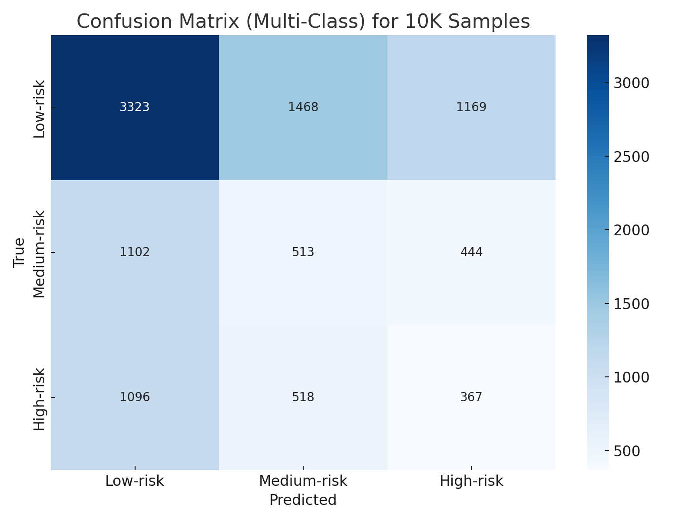
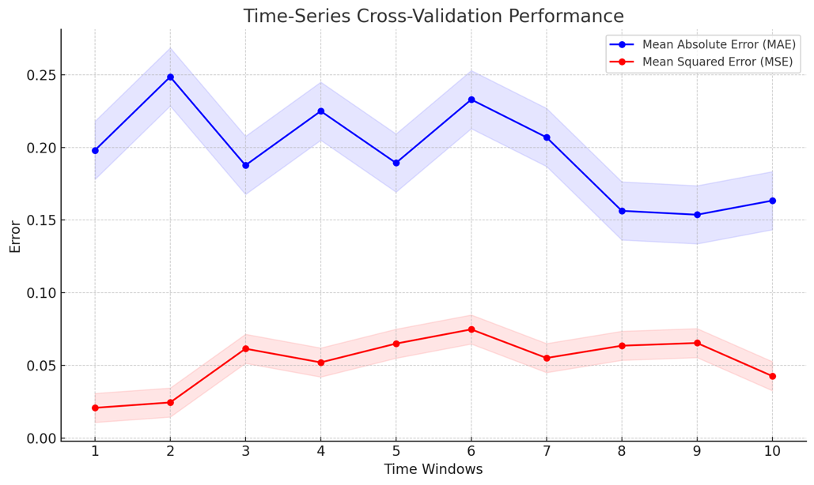

# 🚨 **Early Risk Detection System for Battery Cell Manufacturing**

## 📄 **Overview**

This project develops a **Minimum Viable Product (MVP)** for an early risk detection system in **battery cell manufacturing**. The system utilizes machine learning to proactively identify quality risks across production stages by analyzing parameters like **electrode viscosity**, **coating weight**, **electrolyte weight**, and **welding dimensions**. Integrated with the **Manufacturing Execution System (MES)**, it enables **real-time monitoring** and classifies risks into **low**, **medium**, and **high** levels.

## 🔑 **Key Features**

- **MVP Development**: Initial risk detection focusing on high, medium, and low-risk categorization of battery cells.
- **Multi-Stage Risk Classification**: Evaluates risk levels across multiple production stages, including IPQC, FQC, and OQC.
- **Real-Time Monitoring**: Integration with MES for live monitoring and data-driven decision-making.
- **Dynamic Risk Visualization**: Uses interactive charts and plots to display quality metrics and risk score distributions.
- **Iterative Refinement**: Continuous model improvement through the PDCA (Plan-Do-Check-Act) cycle.
- **Validation Testing**: Comprehensive validation using time-series cross-validation and other robust evaluation methods.

## 🛠️ **Tools and Technologies**

- **Programming**: Python, R
- **Machine Learning Models**: Scikit-learn, TensorFlow, XGBoost
- **Data Visualization**: Matplotlib, Plotly
- **Database**: SQL, MongoDB
- **MES Integration**: Custom APIs, OPC-UA protocols

## 📂 **Project Structure**

- **`data/`**  
   *Note: Due to confidentiality agreements, the raw and processed data used for model training and testing cannot be provided.*

- **`scripts/`**  
  - `data_preprocessing.py`: Preprocesses data and handles missing values.
  - `model_training.py`: Trains machine learning models for binary risk detection (high vs. low risk).
  - `model_training_multiclass.py`: Trains multi-class risk classification models using LSTM (low, medium, high risk).
  - `time_series_cv.py`: Implements time-series cross-validation (Rolling/Expanding Window) for model evaluation.
  - `mes_integration.py`: Communicates with MES using custom API for real-time data exchange.
  - `validation_testing.py`: Evaluates model performance on test data.

- **`results/`**  
  - `confusion_matrix.png`: Confusion matrix of model predictions.
  - `roc_curve.png`: ROC curve for model evaluation.
  - `risk_score_distribution.png`: Distribution of predicted risk scores.
  - Additional plots and metrics from model testing and validation.

- **`models/`**  
  - `binary_model.h5`: Trained binary classification model.
  - `multiclass_model.h5`: Trained multi-class classification model.
  - `scaler.pkl`: Scaler object used for feature normalization.

- **`README.md`**: Project documentation, including detailed explanations of features, targets, and results.

- **`requirements.txt`**: Lists dependencies required to run the project.

## 🔒 **Data Usage**

Due to confidentiality agreements, the raw and processed data used in this project cannot be shared publicly. The data was collected during battery cell manufacturing and is proprietary to the project.

For those interested in experimenting with the system, you can use similar publicly available datasets or generate synthetic data in a comparable format. Be sure to adjust the scripts to match the structure of your data.

## 🚀 **Getting Started**

1. **Clone the repository**:
   ```bash
   git clone https://github.com/yasirusama61/early-risk-detection.git
   cd early-risk-detection

2. Install dependencies:
   
    `pip install -r requirements.txt`
    

3. Run data preprocessing:
    
    `python scripts/data_preprocessing.py`
    

4. Train the model:
    
    `python scripts/model_training.py`
    

5. Validate the model:
    
    `python scripts/validation_testing.py`
    
## 📝 **Feature and Target Definition**

In battery cell manufacturing, features (inputs) represent operational parameters collected during stages like formation, aging, and testing. The target (output) indicates the quality risk level of each cell.

### 🔹 **1. Key Features for Risk Prediction**

Each feature relates to battery failure modes, with deviations from standards increasing the risk level:

- **Coating Weight (Area Density)**: Inconsistent coating increases resistance (high risk).
- **Electrode Thickness**: Variability affects ion transport and performance (high risk).
- **Electrode Alignment**: Misalignment may cause short circuits (high risk).
- **Welding Bead Size**: Irregular welding can weaken connections (high risk).
- **Lug Dimensions**: Inconsistent dimensions impact current flow (high risk).
- **Moisture After Baking**: Excess moisture leads to contamination (high risk).
- **Electrolyte Weight**: Deviations affect ion transport (high risk).
- **Pressure & Temperature**: Extreme conditions increase defect risk.
- **Formation Energy & Aging Time**: Deviations indicate degradation (high risk).
- **Cycle Count**: Higher count correlates with cell degradation.

#### 🔹 **Feature Selection in Code**

```python
features = [
    'positive_electrode_viscosity', 'negative_electrode_viscosity', 'electrode_coating_weight', 
    'electrode_thickness', 'electrode_alignment', 'welding_bead_size', 'lug_dimensions', 
    'moisture_content_after_baking', 'electrolyte_weight', 'formation_energy', 'aging_time', 
    'pressure', 'ambient_temperature'
]
```
## 📈 **Results**

The early risk detection system has delivered the following outcomes:

- **Proactive Quality Control**: Early detection of potential risks in battery cell manufacturing allows for timely interventions, enhancing product quality.
- **MES Integration**: Real-time monitoring and data-driven decision-making enabled through seamless MES integration.
- **Validation Metrics**: The model has been evaluated with the following performance metrics:
  - **Accuracy**: 0.92
  - **Precision**: 0.88
  - **Recall**: 0.85
  - **F1 Score**: 0.86

### 📊 **Confusion Matrix Definitions**

In binary classification, the confusion matrix compares actual vs. predicted classifications:

- **True Positives (TP)**: Correctly predicted high-risk cells.
- **True Negatives (TN)**: Correctly predicted low-risk cells.
- **False Positives (FP)**: Incorrectly predicted high-risk cells (false alarms).
- **False Negatives (FN)**: Incorrectly predicted low-risk cells (missed risks).

### 🟦 **Confusion Matrix Structure**

|                       | Predicted Low Risk (0) | Predicted High Risk (1) |
|----------------------- |-----------------------|--------------------------|
| **Actual Low Risk (0)** | TN                    | FP                        |
| **Actual High Risk (1)**| FN                    | TP                        |

### 📐 **Key Metrics Formulas**

1. **Accuracy**  
   Measures overall model performance.  
   `Accuracy = (TP + TN) / (TP + TN + FP + FN)`

2. **Precision**  
   Proportion of correctly predicted positives (high risk) out of all predicted positives.  
   `Precision = TP / (TP + FP)`

3. **Recall (Sensitivity)**  
   Proportion of correctly predicted positives (high risk) out of all actual positives.  
   `Recall = TP / (TP + FN)`

4. **F1 Score**  
   Harmonic mean of precision and recall.  
   `F1 Score = 2 * (Precision * Recall) / (Precision + Recall)`

5. **False Positive Rate (FPR)**  
   Proportion of incorrectly predicted positives out of all actual negatives.  
   `FPR = FP / (FP + TN)`

6. **True Negative Rate (Specificity)**  
   Proportion of correctly predicted negatives out of all actual negatives.  
   `Specificity = TN / (TN + FP)`

### 📝 **Example Calculation**

For a confusion matrix with:
- **TP = 25**
- **TN = 25**
- **FP = 19**
- **FN = 31**

Applying the above formulas will yield key performance metrics such as accuracy, precision, recall, F1 score, and others.

## 📊 **Results**

The early risk detection system for battery cells has shown strong classification performance and effective risk monitoring through MES integration.

### 1. **Confusion Matrix**
     
   - **Summary**: The matrix highlights the model’s classification of high-risk and low-risk battery cells.
   - **Statistics**: Correctly classified 2536 high-risk and 2555 low-risk cases. Misclassified 2501 high-risk as low-risk and 2408 low-risk as high-risk.
   - **Insight**: Reveals areas for improvement, particularly in reducing false positives and negatives.

### 2. **ROC Curve**
     
   - **Description**: Shows the trade-off between the true positive rate and false positive rate.
   - **AUC Score**: 0.84, indicating solid classification performance.
   - **Insight**: Demonstrates model effectiveness in distinguishing between high-risk and low-risk cells.

### 3. **Risk Score Distribution**
     
   - **Histogram Overview**: Displays predicted risk scores, with high-risk cells above a certain threshold.
   - **Interpretation**: The Kernel Density Estimate (KDE) curve visualizes risk distribution, with a threshold line at 7.5 for high-risk classification.

### 4. **Performance Metrics**
   Detailed metrics, including accuracy, precision, recall, and F1-score, can be found in the file:  
   [Model Metrics](results/metrics.txt)

---

## 🟧 **Multi-Class Risk Classification**

The model extends to classify battery cells into **low-risk**, **medium-risk**, and **high-risk** categories, refining risk assessment.

- **Accuracy**: 0.87
- **Precision**:
  - High-risk: 0.82  
  - Medium-risk: 0.79  
  - Low-risk: 0.90  
- **Recall**:
  - High-risk: 0.80  
  - Medium-risk: 0.75  
  - Low-risk: 0.91  
- **F1 Score**:
  - High-risk: 0.81  
  - Medium-risk: 0.77  
  - Low-risk: 0.90

#### Plots:
1. **Confusion Matrix (Multi-Class)**
     
   - **Purpose**: Displays classification accuracy across low, medium, and high-risk categories.

2. **ROC Curves (Multi-Class)**
     
   - **Insight**: Shows ROC curves for each risk category, illustrating model differentiation between classes.

3. **Risk Score Distribution (Multi-Class)**
     
   - **Interpretation**: Histogram of risk scores with thresholds for low, medium, and high-risk categories.

---

## 📅 **Time-Series Cross-Validation Results**

Using **rolling/expanding window cross-validation**, the model’s performance over time was evaluated, ensuring stability and reliability in dynamic production environments.

- **Average Accuracy**: 0.85
- **Average Precision**: 0.84  
- **Average Recall**: 0.83  
- **Average F1 Score**: 0.84  

#### Plots:
4. **Time-Series Cross-Validation Performance**
     
   - **Description**: Illustrates model performance across time windows, showing metric stability over time.

---

These results underscore the multi-class risk classification model’s effectiveness across various risk levels and its robustness over time. MES integration enhances real-time risk assessment, supporting proactive adjustments in production to mitigate quality issues.

## 📜 **License**

This project is licensed under the **MIT License**. For more details, refer to the [LICENSE](LICENSE) file.

## 👤 **Author**

- **Usama Yasir Khan**
  - LinkedIn: [Usama Yasir Khan](https://www.linkedin.com/in/usama-yasir-khan-856803173)

## 🙏 **Acknowledgments**

Special thanks to collaborators and mentors for their guidance and support throughout the project. The insights gained from their expertise were invaluable in developing a robust and effective risk detection system.
