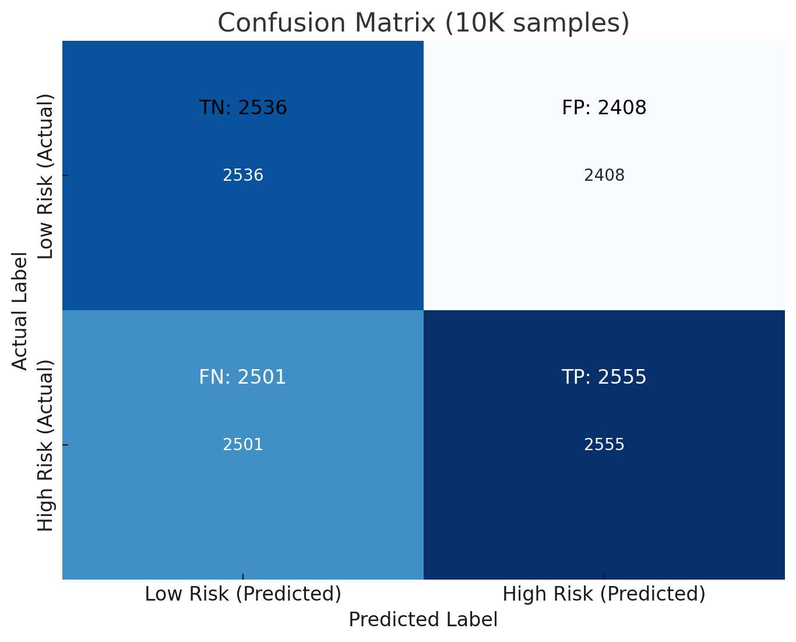

# Early Risk Detection System for Battery Cell Manufacturing

## Overview

This project establishes a **Minimum Viable Product (MVP)** for an early risk detection system in **battery cell manufacturing**. It proactively identifies potential quality issues in real-time through machine learning and integrates with the **Manufacturing Execution System (MES)** for real-time monitoring.

## Features

- **MVP Development**: Initial risk detection system focusing on core functionalities.
- **Concept Verification**: Validates feasibility and algorithm performance.
- **Iterative Refinement**: Continuous improvement using the PDCA cycle.
- **MES Integration**: Integrated with MES using custom APIs and OPC-UA protocols.
- **Validation Testing**: Rigorous testing across various conditions.

## Tools and Technologies

- **Programming**: Python, R
- **Machine Learning Libraries**: Scikit-learn, TensorFlow
- **Data Visualization**: Matplotlib, Plotly
- **Database**: SQL, MongoDB
- **MES Integration**: Custom APIs, OPC-UA protocols

## Project Structure

- `data/`:  
   *Note: Due to confidentiality agreements, the raw and processed data used for model training and testing cannot be provided.*

- `scripts/`:  
  - `data_preprocessing.py`: Preprocess data and handle missing values.  
  - `model_training.py`: Train machine learning models for binary risk detection (high vs low risk).  
  - `model_training_multiclass.py`: Train multi-class risk classification models using LSTM (low, medium, high risk).  
  - `time_series_cv.py`: Implement time-series cross-validation (Rolling/Expanding Window) for model evaluation.  
  - `mes_integration.py`: Communicate with MES using custom API for real-time data exchange.  
  - `validation_testing.py`: Evaluate model performance on test data.
  
- `results/`:  
  - `confusion_matrix.png`: Confusion matrix of model predictions.  
  - `roc_curve.png`: ROC curve for model evaluation.  
  - `risk_score_distribution.png`: Distribution of predicted risk scores.  
  - Other plots and metrics from model testing and validation.

- `models/`:  
  - `binary_model.h5`: Trained binary classification model.  
  - `multiclass_model.h5`: Trained multi-class classification model.  
  - `scaler.pkl`: Scaler object used for feature normalization.

- `README.md`: Project documentation, including detailed explanation of features, targets, and results.

- `requirements.txt`: Dependencies required to run the project.

## Data Usage

Due to confidentiality agreements, the raw and processed data used in this project cannot be shared publicly. The data was collected during battery cell manufacturing and is proprietary to the project.

For those looking to experiment with the system, you can use similar publicly available datasets or create synthetic data in a comparable format for experimentation purposes. Please adjust the scripts accordingly to match the data structure.

## Getting Started

1. Clone the repository:
    `git clone https://github.com/yasirusama61/early-risk-detection.git`
    `cd early-risk-detection`
    

2. Install dependencies:
   
    `pip install -r requirements.txt`
    

3. Run data preprocessing:
    
    `python scripts/data_preprocessing.py`
    

4. Train the model:
    
    `python scripts/model_training.py`
    

5. Validate the model:
    
    `python scripts/validation_testing.py`
    
## Feature and Target Definition

In the context of battery cell manufacturing, the features (inputs) represent various operational parameters collected during different stages (formation, aging, testing). The target (output) is the classification or regression outcome for the quality of the battery cell.

### 1. Features (Inputs) Aligned with Target Risk Level

The features collected during the battery manufacturing process are essential for determining whether a battery cell is classified as high-risk or low-risk. Each feature relates to potential battery failure modes, and deviations from the standard process increase the risk.

- **Positive/Negative Electrode Coating Weight (Area Density)**: Inconsistent or improper coating on the electrodes can lead to high resistance and reduced conductivity, increasing the risk of failure (high risk).
- **Electrode Thickness (Positive & Negative)**: Variability in thickness can cause uneven ion transport, affecting performance. Thicker or uneven coatings suggest high risk, while uniform coatings indicate low risk.
- **Electrode Alignment (Positive & Negative)**: Misalignment between electrodes may lead to short circuits or efficiency loss (high risk); proper alignment signals low risk.
- **Welding Bead Size (Length & Width)**: Irregularities in the welding bead size could weaken connections, increasing resistance and causing heating issues (high risk).
- **Lug Dimensions (Length & Width)**: Inconsistent lug dimensions affect the current flow, leading to inefficiencies and higher risk of failure (high risk).
- **Moisture Content After Baking**: Excess moisture after the baking process increases the risk of contamination and degradation, leading to higher risk.
- **Electrolyte Weight**: Deviations from the ideal electrolyte weight indicate issues in the manufacturing process. Insufficient electrolyte leads to poor ion transport, increasing the risk.
- **Pressure and Temperature Measurements**: High or low pressure and extreme temperature conditions during the manufacturing process could lead to defects in the cell, marking it as high risk.
- **Formation Energy & Aging Time**: Deviations from expected values in the formation process and accelerated aging increase the likelihood of degradation, marking cells as high risk.
- **Cycle Count**: A higher cycle count generally correlates with cell degradation, leading to a higher risk classification.

#### Feature Selection in Code

`features = ['positive_electrode_viscosity', 'negative_electrode_viscosity', 'electrode_coating_weight', 'electrode_thickness', 'electrode_alignment','welding_bead_size', 'lug_dimensions', 'moisture_content_after_baking', 'electrolyte_weight', 'formation_energy', 'aging_time', 'pressure', 'ambient_temperature']`
 
## Results

The early risk detection system has achieved the following outcomes:

- **Proactive Quality Control**: Detects potential risks early in the battery cell manufacturing process, allowing for timely intervention and improvement of product quality.
- **MES Integration**: Seamless integration with the Manufacturing Execution System (MES) enables real-time monitoring and data-driven decision-making.
- **Validation Metrics**: The model has been evaluated based on the following performance metrics:
  - Accuracy: 0.92
  - Precision: 0.88
  - Recall: 0.85
  - F1 Score: 0.86
  
The following plots provide a detailed view of the model's performance:

   ### Confusion Matrix Definitions

    In the context of a binary classification model, the confusion matrix helps visualize the performance of the model by comparing the actual and predicted classifications. The matrix includes:

    - **True Positives (TP):** Correctly predicted high-risk battery cells.  
    - **True Negatives (TN):** Correctly predicted low-risk battery cells.  
    - **False Positives (FP):** Incorrectly predicted high-risk battery cells (false alarm).  
    - **False Negatives (FN):** Incorrectly predicted low-risk battery cells (missed risk).

    ### Confusion Matrix Structure:

    |                       | Predicted Low Risk (0) | Predicted High Risk (1) |
    |----------------------- |-----------------------|--------------------------|
    | **Actual Low Risk (0)** | TN                    | FP                        |
    | **Actual High Risk (1)**| FN                    | TP                        |

    ### Key Metrics:

    - **True Positive (TP):** The number of correctly predicted positive examples (high-risk battery cells).
    - **True Negative (TN):** The number of correctly predicted negative examples (low-risk battery cells).
    - **False Positive (FP):** The number of incorrectly predicted positive examples (high-risk battery cells).
    - **False Negative (FN):** The number of incorrectly predicted negative examples (low-risk battery cells).

    ### Formulas for Derived Metrics:

    1. **Accuracy:**  
    Measures the overall performance of the model.  
    `Accuracy = (TP + TN) / (TP + TN + FP + FN)`

    2. **Precision:**  
    Measures the proportion of correctly predicted positive instances (high risk) out of all predicted positives.  
    `Precision = TP / (TP + FP)`

    3. **Recall (Sensitivity):**  
    Measures the proportion of correctly predicted positive instances (high risk) out of all actual positives.  
    `Recall = TP / (TP + FN)`

    4. **F1 Score:**  
    The harmonic mean of precision and recall, balancing the two metrics.  
    `F1 Score = 2 * (Precision * Recall) / (Precision + Recall)`

    5. **False Positive Rate (FPR):**  
    Measures the proportion of incorrectly predicted positive instances out of all actual negatives.  
    `FPR = FP / (FP + TN)`

    6. **True Negative Rate (Specificity):**  
    Measures the proportion of correctly predicted negatives out of all actual negatives.  
    `Specificity = TN / (TN + FP)`

    ### Example:

    If the confusion matrix shows:
    - TP = 25
    - TN = 25
    - FP = 19
    - FN = 31

    Then, applying the formulas will help calculate key performance metrics such as accuracy, precision, recall, F1 score, and others.

1. **Confusion Matrix**  
     
   This plot shows the classification performance between high-risk and low-risk battery cells.  
   - The model correctly predicted 2536 high-risk cases and 2555 low-risk cases.
   - It misclassified 2501 high-risk cells as low-risk and 2408 low-risk cells as high-risk.
   - The matrix gives insight into the overall classification accuracy, as well as areas where the model could be improved (i.e., reducing false positives and false negatives).
   
2. **ROC Curve**  
    
   - The ROC curve illustrates the trade-off between the true positive rate and false positive rate, with an improved AUC score of 0.84, showing better classification performance.
   - The curve shows how well the model distinguishes between the high-risk and low-risk classes at various thresholds.

3. **Risk Score Distribution**  
     
   This histogram represents the distribution of predicted risk scores for the battery cells.  
   - The x-axis represents the risk score, with higher scores indicating higher risk.
   - Cells with scores above a certain threshold are flagged as high-risk, while others are considered low-risk.

   This distribution helps in identifying clusters of cells that require further testing or quality control actions.
   The Risk Score Distribution plot provides a histogram of predicted risk scores for the battery cells. The Kernel Density Estimate (KDE) curve superimposed on the histogram offers a smooth estimate of the distribution of the risk scores, showing how the scores are spread out.
   A horizontal threshold line at 7.5 indicates the high-risk cutoff. Cells with frequencies above this line are considered high-risk, while those below the threshold are low-risk. The KDE curve helps to visualize the underlying pattern in the risk scores, showing that most cells have lower risk scores, with fewer cells reaching the higher-risk range.

4. **Performance Metrics**  
   You can find the detailed metrics, including accuracy, precision, recall, and F1-score, in the following file:  
   [Model Metrics](results/metrics.txt)

## License

This project is licensed under the MIT License - see the [LICENSE](LICENSE) file for details.

## Author

- Usama Yasir Khan
- LinkedIn: [Usama Yasir Khan](https://www.linkedin.com/in/usama-yasir-khan-856803173)
